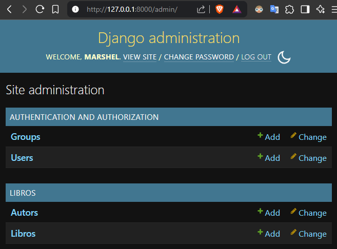
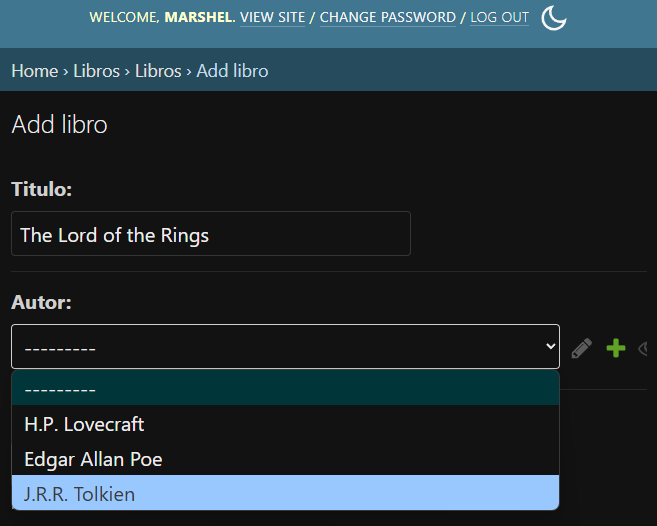
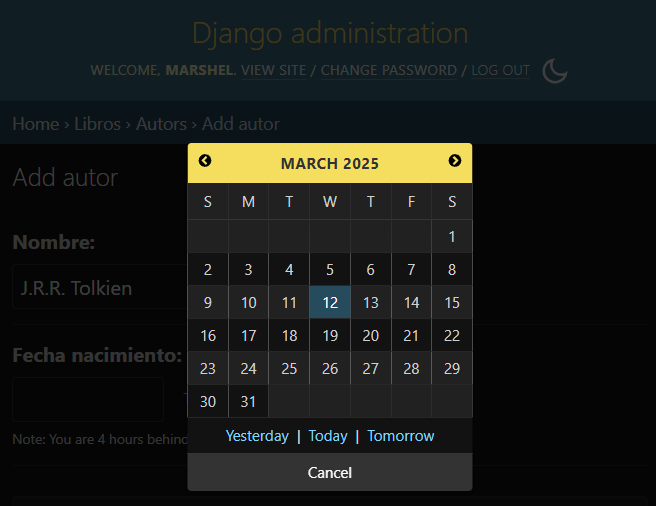

# Uso de Django

## Requisitos Previos
- Python 3.12 instalado en el sistema
- pip

## Creación del Entorno Virtual

1. Abre una terminal en el directorio del proyecto
2. Ejecuta el siguiente comando para crear un entorno virtual:

```bash
  python -m venv env
```

Esto creará un directorio llamado `env` que contendrá el entorno virtual.

## Activación del Entorno Virtual

### En Windows:
```bash
.\env\Scripts\activate
```

### En Linux/Mac:
```bash
source env/bin/activate
```

Una vez activado, verás el nombre del entorno virtual `(env)` al inicio de la línea de comandos.

## Instalación de Dependencias

Con el entorno virtual activado, puedes instalar las dependencias del proyecto usando pip:

```bash
pip install -r requirements.txt
```

## Desactivación del Entorno Virtual

Para salir del entorno virtual, simplemente ejecuta:

```bash
deactivate
```

## Crear proyecto Django

```bash
django-admin startproject practica2
```

## Aplicar migraciones

```bash
python manage.py migrate
```

## Iniciar servidor

```bash
python manage.py runserver
```

## Crear superusuario

```bash
python manage.py createsuperuser
```

## Crear aplicación

```bash
python manage.py startapp libros
```

## Agregar aplicación a settings.py

```bash
INSTALLED_APPS = [
    ...
    'libros',
]
```

## Crear modelo

Escribe el modelo en *libros/models.py*:

```bash
from django.db import models

class Autor(models.Model):
    nombre = models.CharField(max_length=100)
    fecha_nacimiento = models.DateField()

    def __str__(self):
        return self.nombre

class Libro(models.Model):
    titulo = models.CharField(max_length=100)
    autor = models.ForeignKey(Autor, on_delete=models.CASCADE, related_name="libros")
    fecha_publicacion = models.DateField()

    def __str__(self):
        return self.titulo
```

## Crear migraciones

```bash
python manage.py makemigrations
```

## Aplicar migraciones
```bash
python manage.py migrate
```

## Configurar admin.py

Escribe el siguiente código en *libros/admin.py*

```bash
from django.contrib import admin
from .models import Autor, Libro

admin.site.register(Autor)
admin.site.register(Libro)
```

## Iniciar servidor 

```bash
python manage.py runserver
```

## Acceder al panel de administración

Abre tu navegador y ve a http://localhost:8000/admin/. Inicia sesión con el superusuario que creaste anteriormente. Deberías ver las opciones para agregar autores y libros.

____

## Capturas de pantalla


___

___
